# n8n Automation Workflow Lab

An automation workflow built with **n8n** to receive webhook data, validate input, save valid records to **Google Sheets**, send **Discord notifications**, and return API responses.

This project demonstrates a complete workflow automation process including webhook handling, data validation, conditional logic, third-party integration, notification automation, and API response handling.

---

## Workflow Overview

The workflow receives JSON data from a webhook, validates the required fields, and separates the process into success and error branches.

```text
Webhook
  ↓
Validate Input
  ↓
Check Valid Data
  ├── false → Respond Error
  └── true  → Save to Google Sheets
                ↓
              Send Discord Notification
                ↓
              Respond Success
```

---

## Features

- Receive data through an n8n Webhook
- Handle JSON request body
- Validate required fields
- Check basic email format
- Generate request ID automatically
- Save valid data to Google Sheets
- Send Discord notification after successful submission
- Return `200 OK` response for valid data
- Return `400 Bad Request` response for invalid data
- Test workflow using Postman
- Export workflow as reusable JSON file

---

## Tech Stack

- n8n
- Docker
- Webhook
- JavaScript Code Node
- IF Node
- Google Sheets
- Discord Webhook
- Postman

---

## Project Structure

```text
n8n-automation-workflow-lab/
│
├── README.md
├── test-cases.md
│
├── workflow/
│   └── n8n-automation-workflow-lab.json
│
├── samples/
│   ├── request-success.json
│   ├── request-error-missing-email.json
│   └── request-error-invalid-email.json
│
└── docs/
    ├── 01-workflow-overview.png
    ├── 02-webhook-settings.png
    ├── 03-validate-input-code.png
    ├── 04-check-valid-data-if.png
    ├── 05-respond-error-node.png
    ├── 06-google-sheets-node.png
    ├── 07-discord-notification-node.png
    ├── 08-respond-success-node.png
    ├── 09-postman-success-200.png
    ├── 10-postman-error-400.png
    ├── 11-google-sheets-result.png
    ├── 12-discord-notification-result.png
    └── 13-production-url-test.png
```

---

## Workflow Logic

### 1. Webhook

The workflow starts with a Webhook node that receives a `POST` request.

```text
Method: POST
Path: automation-lab
Response Mode: Using Respond to Webhook Node
```

Example webhook endpoint:

```text
http://localhost:5678/webhook/automation-lab
```

---

### 2. Validate Input

The Code node validates and normalizes the input data.

Required fields:

```text
name
email
subject
message
```

Validation rules:

- `name` must not be empty
- `email` must not be empty
- `email` must contain `@`
- `subject` must not be empty
- `message` must not be empty

Example output from validation:

```json
{
  "id": "REQ-1780000000000",
  "name": "Earth",
  "email": "earth@example.com",
  "subject": "Success Test",
  "message": "This data should be saved and notified.",
  "type": "general",
  "status": "valid",
  "isValid": true,
  "errors": [],
  "createdAt": "2026-06-27T00:00:00.000Z"
}
```

---

### 3. Check Valid Data

The IF node checks the value of:

```text
isValid
```

Condition:

```text
isValid is equal to true
```

Workflow branches:

```text
true  → Save to Google Sheets → Send Discord Notification → Respond Success
false → Respond Error
```

---

### 4. Save to Google Sheets

Valid data is appended to Google Sheets.

Google Sheets columns:

```text
id
createdAt
name
email
subject
message
type
status
```

---

### 5. Send Discord Notification

After saving data to Google Sheets, the workflow sends a Discord notification using an HTTP Request node.

Example notification content:

```text
New form data received
ID: REQ-1780000000000
Name: Earth
Email: earth@example.com
Subject: Success Test
Message: This data should be saved and notified.
```

---

### 6. Respond Success

If the request is valid and the workflow runs successfully, the workflow returns:

```json
{
  "success": true,
  "message": "Data saved successfully"
}
```

Status code:

```text
200 OK
```

---

### 7. Respond Error

If validation fails, the workflow returns:

```json
{
  "success": false,
  "message": "Validation failed",
  "errors": ["Email is required"]
}
```

Status code:

```text
400 Bad Request
```

---

## Sample Request

### Valid Request

```json
{
  "name": "Earth",
  "email": "earth@example.com",
  "subject": "Success Test",
  "message": "This data should be saved and notified.",
  "type": "general"
}
```

---

### Missing Email Request

```json
{
  "name": "Earth",
  "email": "",
  "subject": "Error Test",
  "message": "This data should not be saved.",
  "type": "general"
}
```

---

### Invalid Email Format Request

```json
{
  "name": "Earth",
  "email": "earthgmail.com",
  "subject": "Invalid Email Test",
  "message": "Testing invalid email format.",
  "type": "general"
}
```

---

## API Responses

### Success Response

```json
{
  "success": true,
  "message": "Data saved successfully"
}
```

Status:

```text
200 OK
```

---

### Error Response

```json
{
  "success": false,
  "message": "Validation failed",
  "errors": ["Email is required"]
}
```

Status:

```text
400 Bad Request
```

---

## Test Cases

Test cases are documented in:

```text
test-cases.md
```

Test scenarios include:

| Test Case ID | Scenario                    | Expected Status | Result |
| ------------ | --------------------------- | --------------: | ------ |
| TC-001       | Submit valid data           |          200 OK | Passed |
| TC-002       | Submit without email        | 400 Bad Request | Passed |
| TC-003       | Submit invalid email format | 400 Bad Request | Passed |
| TC-004       | Submit without name         | 400 Bad Request | Passed |
| TC-005       | Submit without subject      | 400 Bad Request | Passed |
| TC-006       | Submit without message      | 400 Bad Request | Passed |

---

## Screenshots

### Workflow Overview

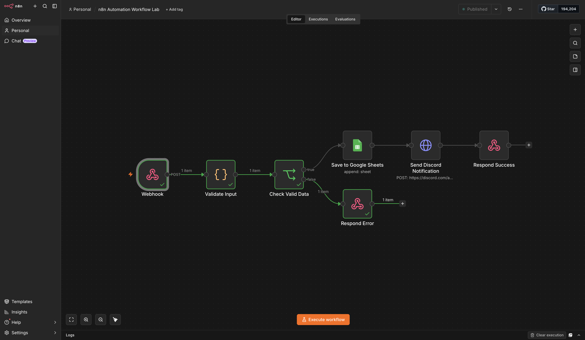

---

### Webhook Settings

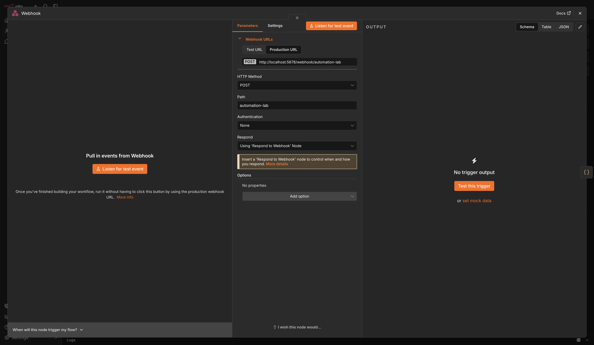

---

### Validate Input Code Node

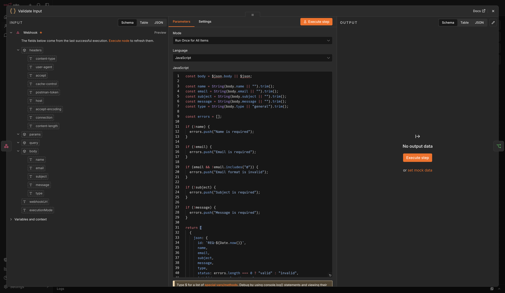

---

### Check Valid Data IF Node

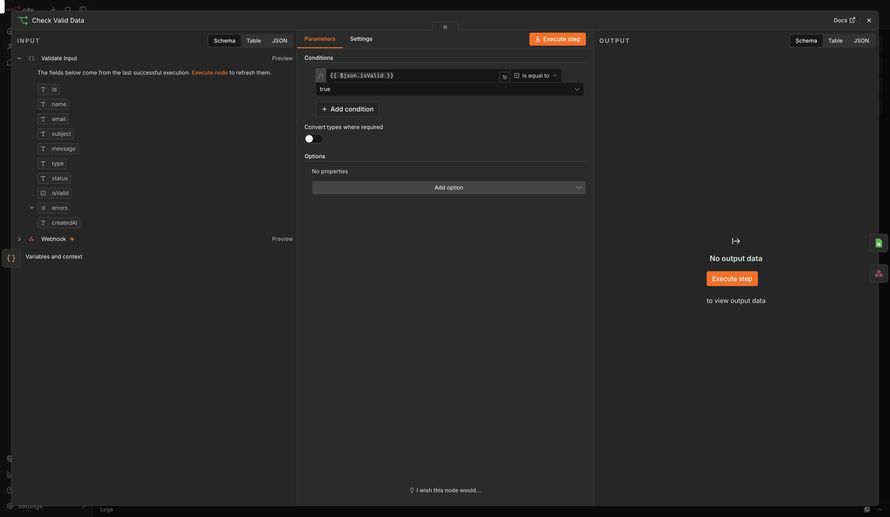

---

### Respond Error Node

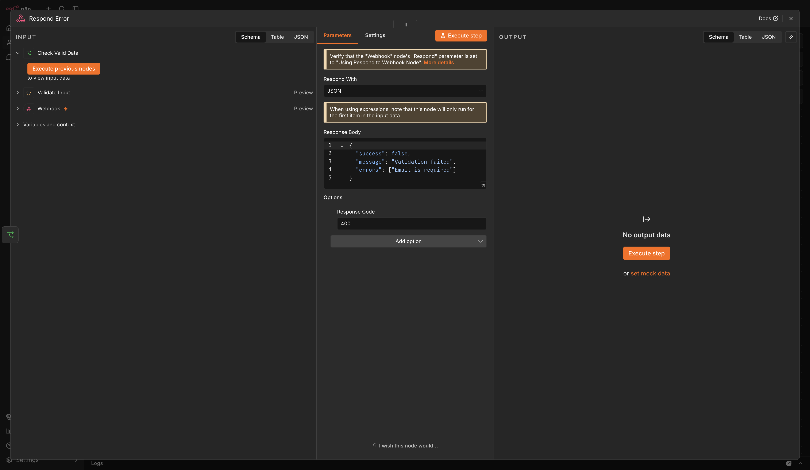

---

### Google Sheets Node

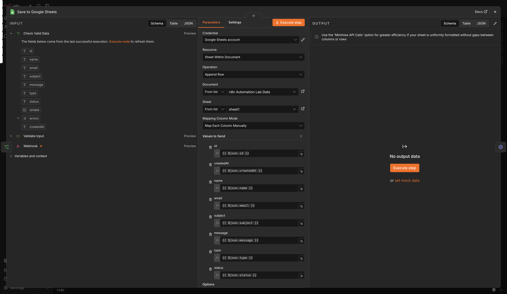

---

### Discord Notification Node

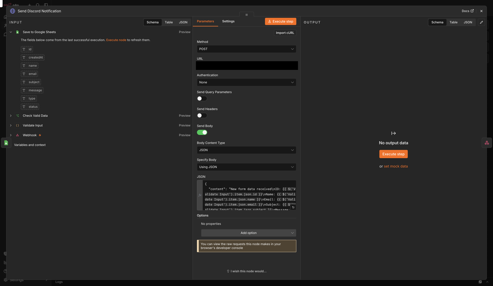

---

### Respond Success Node

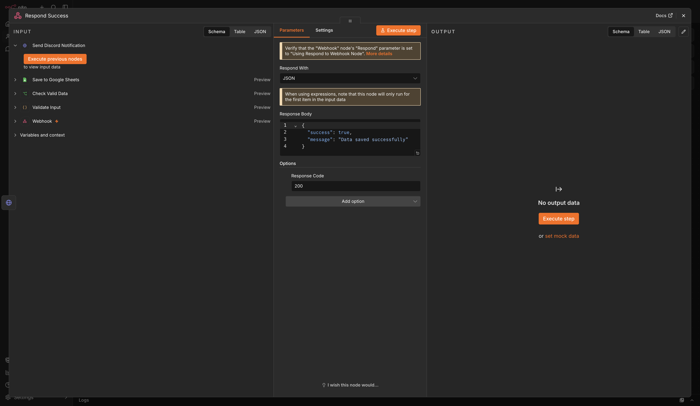

---

### Postman Success Response

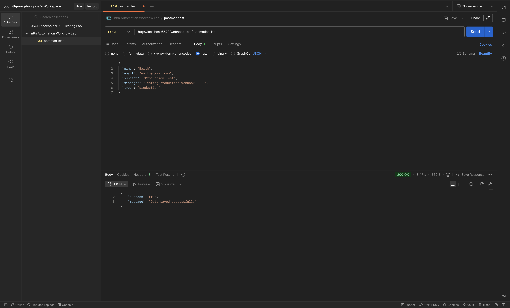

---

### Postman Error Response

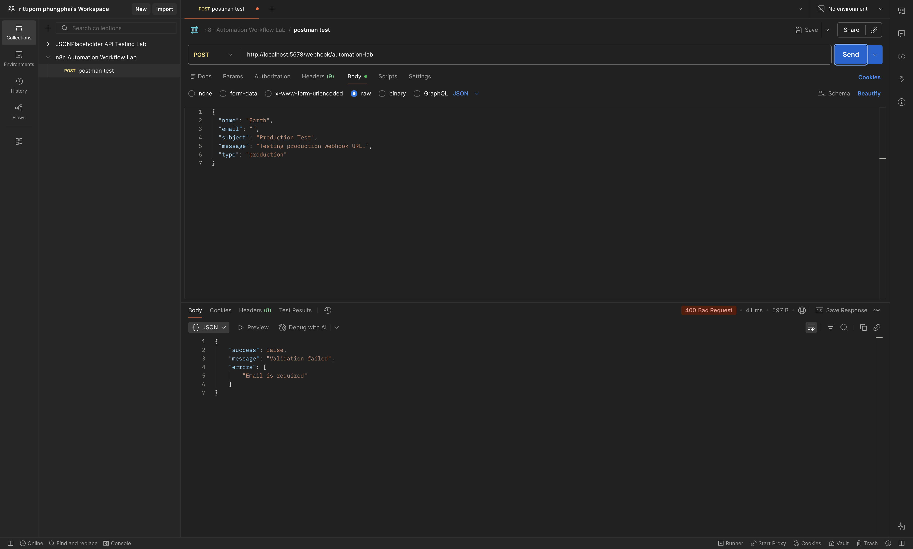

---

### Google Sheets Result

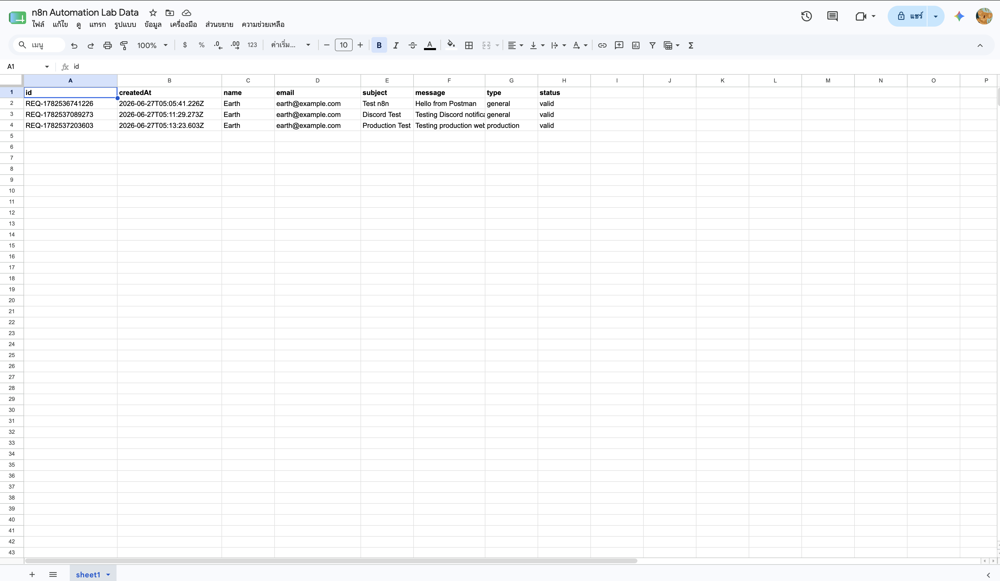

---

### Discord Notification Result

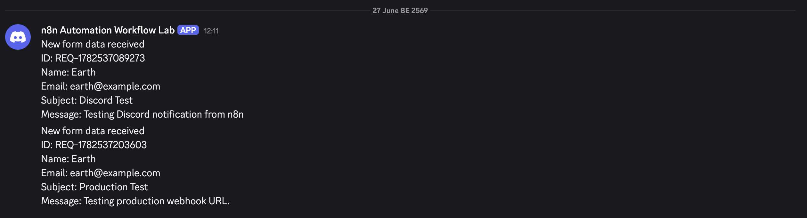

---

### Production URL Test

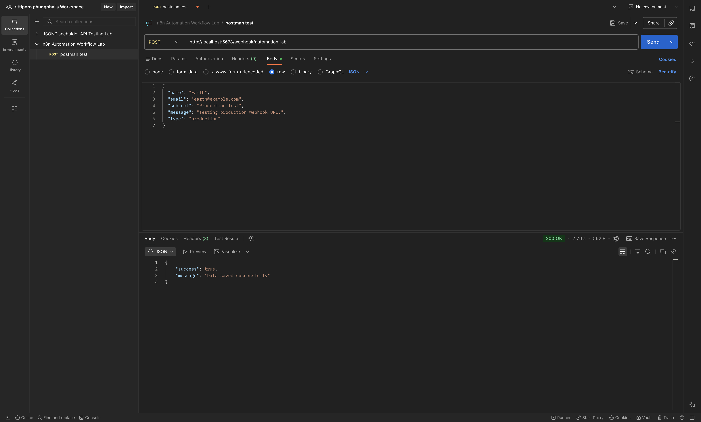

---

## How to Import Workflow

1. Open n8n.
2. Go to **Workflows**.
3. Click **Import from File**.
4. Select the workflow file:

```text
workflow/n8n-automation-workflow-lab.json
```

5. Configure your own Google Sheets credential.
6. Replace the placeholder Discord Webhook URL:

```text
YOUR_DISCORD_WEBHOOK_URL
```

7. Replace the placeholder Google Sheet information if needed:

```text
YOUR_GOOGLE_SHEET_ID
YOUR_GOOGLE_SHEET_URL
```

8. Select your Google Sheet document and sheet.
9. Save the workflow.
10. Activate the workflow.
11. Test the production webhook URL.

---

## Local Development

This workflow was tested using n8n running locally with Docker.

Example local n8n URL:

```text
http://localhost:5678
```

Test webhook URL:

```text
http://localhost:5678/webhook-test/automation-lab
```

Production webhook URL:

```text
http://localhost:5678/webhook/automation-lab
```

---

## Security Notes

This repository does not include real credentials, tokens, or secret webhook URLs.

Before publishing, sensitive values were replaced with placeholders:

```text
YOUR_DISCORD_WEBHOOK_URL
YOUR_GOOGLE_SHEET_ID
YOUR_GOOGLE_SHEET_URL
```

Do not publish the following information:

- Real Discord Webhook URL
- Google OAuth Client Secret
- Google access token
- Google refresh token
- Private credentials
- Personal or sensitive data from Google Sheets

Users who import this workflow must configure their own credentials and webhook URLs.

---

## What I Learned

This project helped practice:

- Building automation workflows with n8n
- Creating webhook-based API flows
- Validating request data using JavaScript
- Handling success and error responses
- Integrating Google Sheets with n8n
- Sending Discord notifications through HTTP Request
- Testing API workflows with Postman
- Documenting workflow logic and test cases

---

## Author

**Rittiporn Phungphai**

GitHub: [Rittiporn12](https://github.com/Rittiporn12)
